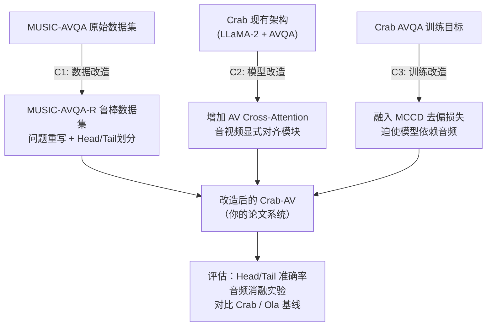

# 学位论文改造可行性方案
## 基于 Crab 的音视频偏置消除与跨模态对齐研究

> **论文题目（建议）**：融合音频信息的视觉内容理解大模型——基于去偏训练与显式跨模态对齐的音视频问答研究

---

## 研究背景与问题

现有音视频问答（AVQA）研究存在两个核心问题：

1. **模态偏置**：模型可仅凭视觉线索获得高准确率，音频信息被边缘化（MUSIC-AVQA-R 论文揭示）
2. **融合表层化**：现有方法（含 Crab）对音视频的融合停留在 Token 拼接层面，缺乏显式跨模态语义对齐

**Crab 现状**：使用 Late Fusion（音频 32 Token + 视频 32 Token 拼接送入 LLM），未对模态偏置做任何处理。

---

## 三个核心创新点



---

## 创新点 C1：数据层改造（MUSIC-AVQA-R 思路）

### 目标
构建一个更鲁棒的 AVQA 评估数据集，揭示当前模型的偏置。

### 具体做法

**步骤 1：问题重写**
- 使用 GPT-4o / Qwen2.5 对 MUSIC-AVQA 测试集（~9000 条）问题进行多轮改写
- Prompt 设计原则：保持语义不变，改变表达形式，打破模板化结构
- 示例：`"What is the left instrument?"` → `"Among all the instruments shown, which one is positioned to the left?"`

**步骤 2：Head/Tail 划分**
```python
# 参考 MUSIC-AVQA-R 方法
mu_a = mean(answer_counts)
threshold = 1.2 * mu_a
head_set = {ans for ans, cnt in answer_counts.items() if cnt > threshold}
tail_set = {ans for ans, cnt in answer_counts.items() if cnt <= threshold}
```

**步骤 3：数据整合**
- 修改 `dataset/AVQA.py` 中的数据加载逻辑，加入 head/tail 标签字段
- 新增 `dataset/avqa_robust.py` 管理重写后的数据集

### 工作量评估
- ⏱️ 预计 **2-3 周**
- 风险低，不涉及模型改动

---

## 创新点 C2：模型层改造（Ola 架构思路移植）

### 目标
在 Crab 的 Q-Former 阶段引入显式的音视频 Cross-Attention，让音频 Query 能够感知视频的时序特征。

### Crab 现状 vs. 改造后

| | Crab 现状 | 改造后（Crab-AV）|
|---|---|---|
| 音频编码 | BEATs → 独立 Q-Former → 32 Token | 同左 |
| 视觉编码 | CLIP → 独立 Q-Former → 32 Token | 同左 |
| 融合方式 | 直接拼接送 LLM，融合靠 Self-Attention | **新增 AV-CrossAttn Layer** |

### 改造位置

**修改文件**：`models/multimodal_encoder.py`

在 `ALProjector.forward()` 中，引入对视觉特征的 Cross-Attention：

```python
class AVCrossAttentionFusion(nn.Module):
    """
    音频 Query 与视频特征做 Cross-Attention，
    让音频表示感知视频时序结构（参考 Ola 的视频-音频桥梁思路）
    """
    def __init__(self, d_model=4096, nhead=8):
        super().__init__()
        self.cross_attn = nn.MultiheadAttention(d_model, nhead, batch_first=True)
        self.norm = nn.LayerNorm(d_model)

    def forward(self, audio_feat, video_feat):
        # audio_feat: (B, 32, D)  video_feat: (B, 32, D)
        fused, _ = self.cross_attn(
            query=audio_feat,
            key=video_feat,
            value=video_feat
        )
        return self.norm(audio_feat + fused)  # 残差连接
```

在 `UnifiedMetaModel.init_multimodal_modules()` 中注册此模块，并在 `encode_audio` 后调用。

### 渐进式对齐训练（来自 Ola）

调整 Crab 的训练策略，从当前的"全任务联合微调"改为：

```
阶段1：图文对齐预训练（已有，沿用 Crab 的 pretrain_visual）
阶段2：音频对齐预训练（已有，沿用 Crab 的 pretrain_audio）
阶段3：引入 AV-CrossAttn 做音视频联合微调（新增）
阶段4：AVQA 专项+去偏损失微调（新增，见 C3）
```

### 工作量评估
- ⏱️ 预计 **3-4 周**（含消融实验）

---

## 创新点 C3：训练层改造（MCCD 去偏机制）

### 目标
在 AVQA 训练目标中引入 MCCD 损失，通过对比单模态预测与多模态融合预测，迫使模型真正利用音频。

### MCCD 原理

```
多模态预测   P_av  = f(audio, video, question)
视觉单模态   P_v   = f(video, question)         # 遮蔽音频
音频单模态   P_a   = f(audio, question)         # 遮蔽视频

去偏损失 = CE(P_av, y) + λ·KL(P_av || P_v) + λ·KL(P_av || P_a)
（让多模态分布与单模态分布拉开距离，强迫融合发挥作用）
```

### 修改位置

**修改文件**：`models/unified_llama.py` 的 `forward()` 函数

```python
# 在 forward 中增加去偏损失计算分支
if self.training and use_mccd:
    # 视觉单模态前向（遮蔽音频Token）
    v_logits = self.forward_single_modal(inputs_embeds, mask='audio')
    # 音频单模态前向（遮蔽视频Token）
    a_logits = self.forward_single_modal(inputs_embeds, mask='video')
    # 去偏 KL 散度损失
    kl_loss = kl_div(P_av, P_v) + kl_div(P_av, P_a)
    total_loss = ce_loss + self.mccd_lambda * kl_loss
```

**修改文件**：`configs/unified_config.py`，新增 `use_mccd`、`mccd_lambda` 参数

### 工作量评估
- ⏱️ 预计 **2-3 周**

---

## 时间规划

| 时间 | 任务 | 产出 |
|------|------|------|
| **第 1-3 周** | C1：问题重写 + Head/Tail 划分 | MUSIC-AVQA-R 格式数据集 |
| **第 4-5 周** | 在 Crab 上跑 MUSIC-AVQA 基线评估（含 Head/Tail 分组） | 偏置分析结果，论文第3章素材 |
| **第 6-9 周** | C2：实现 AV-CrossAttn 模块，联合微调 | 测试跨模态对齐效果 |
| **第 10-12 周** | C3：实现 MCCD 损失，专项微调 | 去偏效果对比实验 |
| **第 13-15 周** | 综合评估：对比 Crab 基线 / Ola 基线 | 论文实验章节 |
| **第 16-20 周** | 论文写作、修改 | 终稿 |

---

## 评估体系设计

### 对比基线
1. **Crab 原版**（无任何改动）→ 偏置程度最强
2. **Crab + C1 数据**（用重写数据评估 Crab）→ 揭示偏置
3. **Crab + C2**（加 AV-CrossAttn）→ 验证跨模态对齐
4. **Crab + C2 + C3**（完整方案）→ 论文最终系统
5. **Ola-7B**（外部对比基线）

### 评估指标
- 总体 Accuracy（MUSIC-AVQA 标准）
- **Head 子集 Accuracy**（常见答案，衡量基础能力）
- **Tail 子集 Accuracy**（稀有答案，衡量泛化性）
- **音频贡献消融**：遮蔽音频输入后准确率下降幅度（↓越大 = 音频贡献越显著）

---

## 核心文件改动清单

| 文件 | 改动内容 |
|------|------|
| `dataset/AVQA.py` | 加入 head/tail 标签，支持重写问题加载 |
| `dataset/avqa_robust.py` | [NEW] MUSIC-AVQA-R 格式数据集加载器 |
| `models/multimodal_encoder.py` | 新增 `AVCrossAttentionFusion` 模块，在 `ALProjector` 中调用 |
| `models/unified_arch.py` | `init_multimodal_modules` 注册 AV-CrossAttn |
| `models/unified_llama.py` | `forward()` 增加 MCCD 去偏损失分支 |
| `configs/unified_config.py` | 新增 `use_mccd`、`mccd_lambda`、`use_av_crossattn` 参数 |
| `scripts/finetune/inference_hyper_lora.py` | 新增 Head/Tail 分组评估逻辑 |

---

## 风险评估

| 风险 | 概率 | 应对 |
|------|------|------|
| AV-CrossAttn 带来的性能提升不显著 | 中 | 保留原 Crab 作为消融基线，依然可以通过 C1+C3 形成完整贡献链 |
| MCCD 训练不稳定 | 低 | 从小 `mccd_lambda` 开始调参（推荐初始值 0.1） |
| LLaMA-2 相比 Qwen2.5 基础能力差距大 | 中 | 在 MUSIC-AVQA 任务上 Crab 已有专项微调，差距可控；若仍不足可考虑升级骨干到 Qwen |

> [!IMPORTANT]
> 建议与导师确认：在 Crab（实验室自研工作）上做扩展改造，是否在答辩时能被认定为独立研究贡献。通常实验室内部迭代是被接受的，但需要创新点清晰、贡献边界明确。
